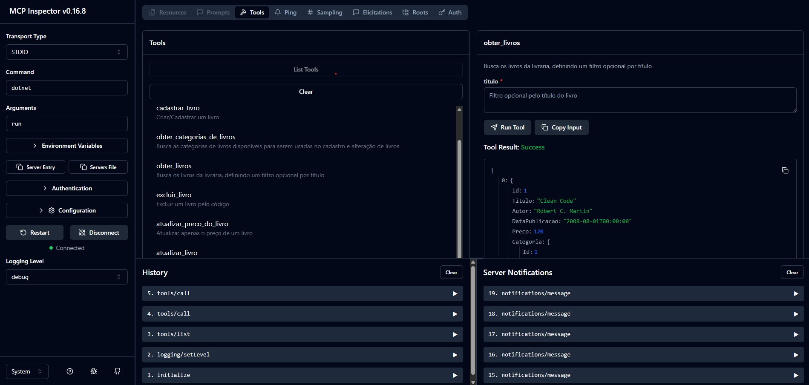
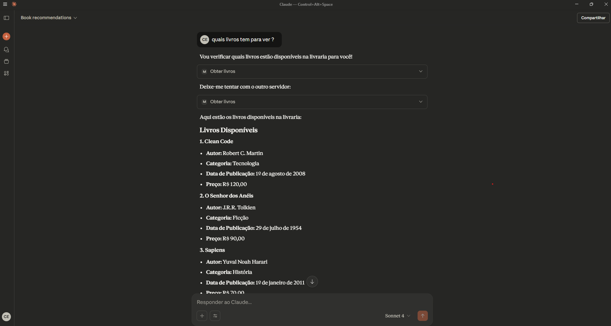

# 📚 API .NET 9 com MCP (Model Context Protocol)

Este projeto demonstra como integrar uma **API em .NET 9** com o **MCP (Model Context Protocol)** para expor funcionalidades que podem ser consumidas por modelos de linguagem, como o **Claude Desktop**.

---

## 🚀 Estrutura do Projeto

- **McpServer** → Projeto console em .NET 9 que implementa o servidor MCP.
- **API** → Endpoints que expõem as operações também via HTTP, se necessário.

O objetivo é permitir que um modelo de linguagem:
1. Entenda comandos do usuário em linguagem natural.
2. Converta em chamadas MCP para a API.
3. Retorne resultados de forma natural.

---

## 🛠️ Pré-requisitos

- [.NET 9 SDK](https://dotnet.microsoft.com/download/dotnet/9.0)
- [Node.js + NPM](https://nodejs.org/)
- [Claude Desktop](https://claude.ai/download)

---

## 🔍 Testando o MCP Server

1. Abra o terminal na pasta do projeto **McpServer**.
2. Rode o servidor usando o inspector oficial:

```bash
npx @modelcontextprotocol/inspector dotnet run
```



💻 Integrando com o Claude Desktop

Para conectar o Claude Desktop ao MCP Server:

Abra as configurações: Settings > Developer > Edit Config > 
Edite o arquivo claude_desktop_config.json e adicione:
```bash
{
  "mcpServers": {
    "mcp-server-api-livros": {
      "command": "C:\\Users\\rivaldo.junior\\Desktop\\korus-mcp\\McpServer\\bin\\Debug\\net9.0\\McpServer.exe",
      "args": [],
      "type": "stdio"
    }
  }
}

```
Reinicie o Claude Desktop para aplicar as alterações.

✅ Fluxo de Funcionamento

O usuário digita no Claude Desktop algo como:

"Liste os livros disponíveis"

O Claude interpreta a intenção e chama a tool do MCP Server (ObterLivros).

O MCP Server retorna os dados em formato estruturado (JSON).

O Claude transforma em linguagem natural e responde:

"Atualmente temos: Clean Code, O Senhor dos Anéis, Sapiens."



